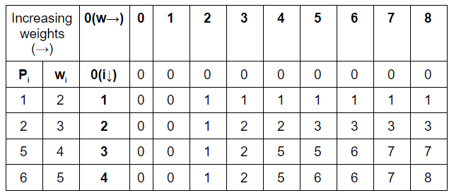

# Problem Description

This project solution attempts to resolve the problem described on this file: [Packaging Challenge](Packaging Challenge.pdf)

# Solution Workflow

## Algorithm Used

The main problem of the challenge is about trying to find the elements that can fit in a package and the as result can 
also be the most profitable ones.

To resolve this problem I decided to go with a **Bottom Up Dynamic Programming** approach. This approach uses a 2d array 
calculate and "preserve previous calculations". It is pretty much as below:



### Time Complexity: 
O(N * W) where N is the amount of items and W the maximum capacity
### Auxiliary Space Complexity: 
O(N * W) Usage of 2d array to preserve operations

### Note:
Time Complexity and Space Complexity are calculated for the algorithm itself and not for the whole project solution.

## Package Approach

The project attemptst to follow and **Package by Layer** in combination with **Package by Feature**

## Design Patterns and Standards

Some of the below design patterns were taken into account even if not all were implemented due to the solution complexity.

- SOLID (Single Responsibility, Open Closed, Liskov Substitution, Interface Segregation, Dependency Inversion)
- DRY (Don't Repeat Yourself)
- Builder
- Use Proper Naming Conventions
- Don't comment the code. For this one the intention is that the code could be well understood by reading it, so hopefully that can be done.
- String Builder

### Note:
There might be more that I forgot to mention but the main intention is to make the code scalable and maintainable.

## Exception Management
I changed the APIException to extend from RuntimeException. The reason behind that is that I will not catch it anywhere 
in the code to be explicitly defined.

I know there might be some disagreement on this one, but as a team we can always define the best practices that make more
sense at the moment.

In that sense, using custom Exceptions is the path to follow so if in the future we want to have our code to be used by 
an endpoint or another mechanism (Sync/Async calls) we can reuse the exceptions and convert it to the needed status code 

## Testing Approach

- TDD was followed as good practice to create Unit Tests as well as Mockito and Junit.
- There is also an Integration Test that attempts to cover the whole scenario to get the most profitable items.

## How to use this dependency?

The class ```com.mobiquity.packer.Packer``` can be used by calling the method ```Pack``` and providing an existing
file absolute path.

If by any chance the file doesn't exist, the ```APIException``` will be thrown.